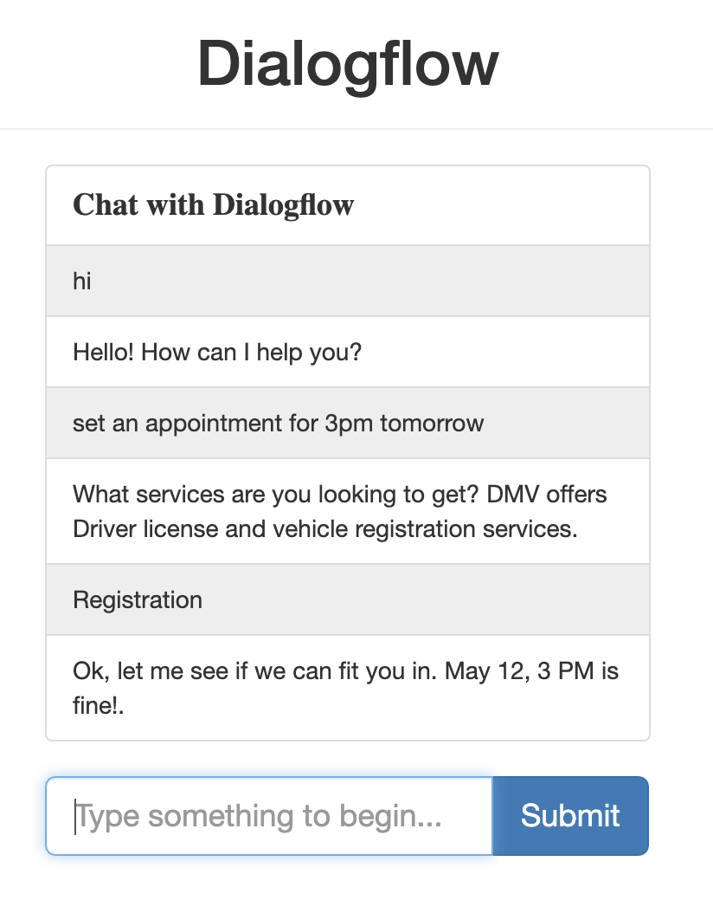
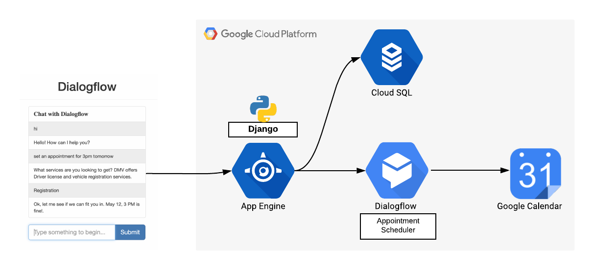

# Django Dialogflow Appointment Scheduler 

Django [Dialogflow](https://dialogflow.com) is a web client to chat with Dialogflow agent Appointment Scheduler.



## Architecture


## Setup Instructions

### Download and run the app
The following sections guide you through configuring, running, and deploying the sample.

Clone the Django app

Clone the repository to your local machine:
```js 
git clone https://github.com/priyankavergadia/Django-Dialogflow-Appointment-Scheduler.git
```
cd into the directory that contains the code/.
Alternatively, you can download the sample as a zip and extract it.

### Setting up your local environment
When deployed, your app uses the Cloud SQL Proxy that is built in to the App Engine environment to communicate with your Cloud SQL instance. However, to test your app locally, you must install and use a local copy of the Cloud SQL Proxy in your development environment.

Learn more about the Cloud SQL Proxy [here](https://cloud.google.com/sql/docs/mysql/sql-proxy).

To perform basic admin tasks on your Cloud SQL instance, you can use the MySQL client.

Note: You must authenticate gcloud to use the proxy to connect from your local machine.

#### Install the Cloud SQL Proxy
Download and install the Cloud SQL Proxy. The Cloud SQL Proxy is used to connect to your Cloud SQL instance when running locally.

Download the proxy:
```js
curl -o cloud_sql_proxy https://dl.google.com/cloudsql/cloud_sql_proxy.darwin.amd64
```

Make the proxy executable:
```js
chmod +x cloud_sql_proxy
```

#### Create a Cloud SQL instance
1. Create a Cloud SQL for MySQL Second Generation instance. Name the instance polls-instance or similar. It can take a few minutes for the instance to be ready. After the instance is ready, it should be visible in the instances list.
2. Be sure to create a Second Generation instance.
3. Now use the Cloud SDK to run the following command where **[YOUR_INSTANCE_NAME]** represents the name of your 4. Cloud SQL instance. Make a note of the value shown for connectionName for the next step.
```js
gcloud sql instances describe [YOUR_INSTANCE_NAME]
```
5. The connectionName value is in the format **[PROJECT_NAME]:[REGION_NAME]:[INSTANCE_NAME]**.

#### Initialize your Cloud SQL instance
Start the Cloud SQL Proxy using the connectionName from the previous step.
```js
./cloud_sql_proxy -instances="[YOUR_INSTANCE_CONNECTION_NAME]"=tcp:3306
```
Replace **[YOUR_INSTANCE_CONNECTION_NAME]** with the value of connectionName that you recorded in the previous step.

This step establishes a connection from your local computer to your Cloud SQL instance for local testing purposes. Keep the Cloud SQL Proxy running the entire time you test your app locally.

Next you create a new Cloud SQL user and database.
1. Create a new database using the GCP Console for your Cloud SQL instance polls-instance. For example, you can use the name polls.
2. Create a new user using the GCP Console for your Cloud SQL instance polls-instance.

#### Configure the database settings
1. Open **mysite/settings.py** for editing.
2. In two places, replace **[YOUR-USERNAME]** and **[YOUR-PASSWORD]** with the database username and password you created previously in the step "Create a Cloud SQL instance". This helps set up the connection to the database for both App Engine deployment and local testing.
3. Run the following command. Copy the outputted connectionName value for the next step.
```js
gcloud sql instances describe [YOUR_INSTANCE_NAME]
```
5. Replace **[YOUR-CONNECTION-NAME]** with connectionName from the previous step.
6. Replace **[YOUR-DATABASE]** with the name you choose during the "Initialize your Cloud SQL instance" step.
7. Close and save settings.py.

### Service Account Setup
1. In Dialogflow's console, go to settings ⚙ and under the general tab, you'll see the project ID section with a Google Cloud link to open the Google Cloud console. Open Google Cloud.
2. In the Cloud console, go to the menu icon **☰ > APIs & Services > Credentials**
3. Under the menu icon **☰ > APIs & Services > Credentials > Create Credentials > Service Account Key**.
4. Under Create service account key, select New Service Account from the dropdown and enter. If you already have a service account key, select that. 
5. AppointmentCalendar for the name and click Create. In the popup, select Create Without Role.
6. JSON file will be downloaded to your computer that you will need in the setup sections below.

### Set up Dialogflow DetectIntent endpoint to be called from the App
1. Inside chat folder, replace the AppointmentScheduler.json with your own credentials json file. 
2. In views.py in chat folder, Change the GOOGLE_PROJECT_ID = **"<YOUR_PROJECT_ID>"** to your project ID

### Build and run the app locally
To run the Django app on your local computer, you'll need to set up a Python development environment, including Python, pip, and virtualenv. For instructions, refer to Setting Up a Python Development Environment for Google Cloud Platform.

Create an isolated Python environment, and install dependencies:
```js
virtualenv env
source env/bin/activate
pip install -r requirements.txt
```
Run the Django migrations to set up your models:
```js
python3 manage.py makemigrations
python3 manage.py makemigrations polls
python3 manage.py migrate
```
Start a local web server:
```js
python3 manage.py runserver
```
In your web browser, enter this address:

http://localhost:8000/
You should see a simple webpage with the text: "Dialogflow" a text box and **submit** button. 
The sample app pages are delivered by the Django web server running on your computer. When you're ready to move forward, press Ctrl+C to stop the local web server.

### Use the Django admin console
Create a superuser:
```js
python3 manage.py createsuperuser
```
Start a local web server:
```js
python3 manage.py runserver
```
Enter this address in your web browser. To log on to the admin site, use the username and password you created when you ran createsuperuser.

http://localhost:8000/admin/

### Deploy the app to the App Engine standard environment
Gather all the static content into one folder. This command moves all of the app's static files into the folder specified by STATIC_ROOT in settings.py:
```js
python3 manage.py collectstatic
```
Upload the app by running the following command from within the directory of the application where the app.yaml file is located:
```js
gcloud app deploy
```
Wait for the message that notifies you that the update has completed.

### See the app run in the cloud
In your web browser, enter this address:
```js
https://<your_project_id>.appspot.com
```
This time, your request is served by a web server running in the App Engine standard environment.

This command deploys the application as described in app.yaml and sets the newly deployed version as the default version, causing it to serve all new traffic.

### Production
When you are ready to serve your content in production, make the following configuration change:

In mysite/settings.py, change the **DEBUG** variable to **False**.

### Testing the sample
Navigate to "https://<your_project_id>.appspot.com", query your Dialogflow agent with `Set an appointment at 4pm tomorrow for drivers license` and respond to the questions your Dialogflow agent asks.   After getting the required information, an appointment will be added to the "Appointment Calendar" calendar. 

If you are using a different dialogflow agent then try out your own training phrases to test the chat application.

### References

[Django app on Appengine](https://cloud.google.com/python/django/appengine)

### LICENSE
Licensed under [Apache2.0](./LICENSE.md)

### Disclaimer
This code is a sample, should not be used for any potential production workloads.

### Terms
Your use of this sample is subject to, and by using or downloading the sample files you agree to comply with, the [Google APIs Terms of Service](https://developers.google.com/terms/).
